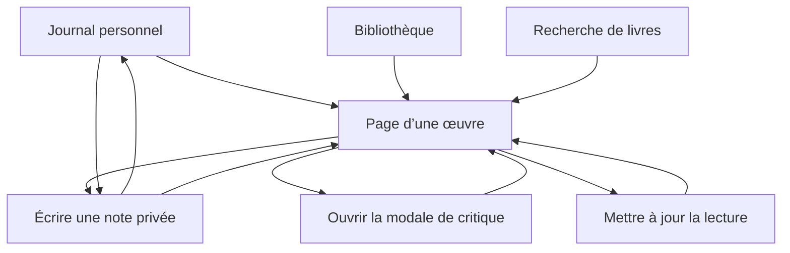

# Chapter — Phase 2 : carte des écrans

Statut : **validé — phase terminée**  
Dernière mise à jour : 22 août 2026

## Objectif de la phase

Définir les écrans nécessaires au premier lot et leurs relations fonctionnelles, sans encore décider de la navigation globale, de leur disposition visuelle ni de leur style.

La carte doit rester assez petite pour soutenir le parcours central validé :

> Retrouver ou chercher une œuvre → consulter sa page → l’ajouter à sa bibliothèque → suivre sa lecture → consigner une note ou publier une critique → retrouver cette trace dans son journal.

## Principe d’architecture proposé

Chapter distinguerait :

- les **écrans de destination**, qui possèdent un rôle durable dans l’expérience et peuvent être rejoints directement ;
- les **états contextuels**, qui servent à accomplir une action courte sans devenir une nouvelle rubrique du produit.

Cette distinction évite de créer une page différente pour chaque opération.

## Écrans de destination proposés

### 1. Journal personnel

Point d’entrée de l’utilisateur connecté. Il rassemble ses lectures en cours, ses traces récentes et des accès rapides pour poursuivre une lecture ou ajouter une pensée.

### 2. Bibliothèque

Vue organisée des œuvres enregistrées selon les statuts « À lire », « En cours » et « Lu ». Elle permet de retrouver une œuvre et d’accéder à sa page.

### 3. Recherche de livres

Espace consacré à une requête et à ses résultats. Il permet d’identifier une œuvre par son titre ou son auteur avant d’ouvrir sa page.

La recherche est considérée comme un écran, plutôt que comme une simple liste flottante, car les résultats doivent rester lisibles sur mobile et pouvoir gérer les requêtes sans résultat ou ambiguës.

### 4. Page d’une œuvre

Nœud central du parcours. Elle rassemble les informations du livre, l’état personnel de l’utilisateur, ses notes ou sa critique et un aperçu limité des critiques publiques.

## États contextuels proposés

### Mise à jour de lecture

Permet de choisir « À lire », « En cours » ou « Lu » et, lorsque cela est pertinent, d’ajouter des dates. Ce contrôle reste rattaché à l’œuvre et ne mérite pas une page autonome.

### Saisie d’une note privée

Permet d’ajouter une pensée personnelle liée à une œuvre. L’action peut être déclenchée depuis la page de l’œuvre et, pour les lectures en cours, depuis le journal. Ces deux points d’accès sont validés ; le contenant précis sera défini plus tard.

### Rédaction d’une critique

La critique est rédigée dans une **fenêtre modale** rattachée à la page de l’œuvre, et non dans un écran autonome. Ce principe est validé.

La modale doit offrir une zone de texte confortable et préserver le contexte du livre. Sur mobile, le clavier réduit fortement la hauteur disponible : le dialogue peut donc occuper presque tout l’écran tout en restant une modale dans son comportement. Ce principe responsive est validé.

Une limite maximale de **3 000 caractères** est appliquée, avec un compteur explicite et sans longueur minimale. Cette valeur permet généralement un simple paragraphe tout en laissant jusqu’à environ 450 à 500 mots aux lecteurs qui souhaitent développer leur opinion. La limite pourra être réévaluée après observation des usages.

### Confirmation de publication

Rappelle clairement qu’une critique devient publique. Il s’agit d’un retour système ou d’une confirmation, pas d’un écran de destination.

### États techniques

Chargement, absence de contenu, erreur, données manquantes et confirmation d’enregistrement sont des états de chaque écran, pas des écrans supplémentaires.

## Relations fonctionnelles proposées

Ce schéma représente les accès fonctionnels, pas encore la navigation globale. Par exemple, il ne décide pas si la recherche sera présente en permanence dans l’en-tête ou accessible par une destination de navigation.

## Éléments volontairement absents

- écran d’accueil marketing ;
- inscription et onboarding ;
- page d’édition bibliographique ;
- profil public détaillé ;
- fil social ;
- notifications ;
- commentaires ;
- statistiques ;
- paramètres complets ;
- écran autonome pour une entrée du journal ;
- écran autonome pour chaque statut de lecture.

## Validation globale

La carte dans son ensemble est validée : quatre écrans de destination — journal, bibliothèque, recherche et page d’une œuvre — reliés aux actions contextuelles présentées ci-dessus.

## Recommandation consolidée

Conserver quatre écrans de destination — journal, bibliothèque, recherche et page d’une œuvre — et traiter les actions d’écriture comme des états contextuels. Cette structure couvre le parcours initial sans introduire prématurément des pages de profil, d’activité sociale ou de gestion bibliographique.

La structure générale et les décisions propres aux actions contextuelles sont validées. Toute modification ultérieure devra être traitée comme une révision explicite.
