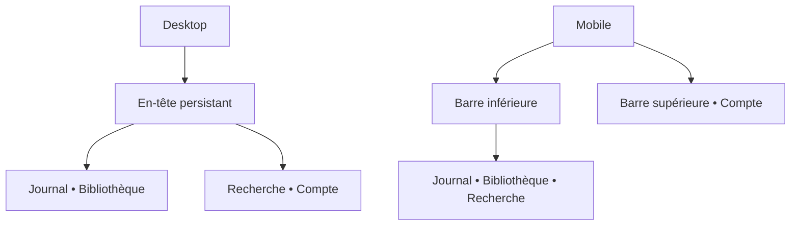

# Chapter — Phase 3 : navigation

Statut : **validé — phase terminée**  
Dernière mise à jour : 22 août 2026

## Objectif de la phase

Définir comment l’utilisateur rejoint les quatre écrans validés et revient à son contexte précédent, sur desktop comme sur mobile, sans encore concevoir leur apparence détaillée.

Cette phase couvre :

- les destinations accessibles globalement ;
- le point d’entrée après connexion ;
- la place de la recherche ;
- l’accès au compte ;
- le comportement de retour ;
- l’adaptation de la navigation entre desktop et mobile.

Elle ne couvre pas encore la composition interne des pages, la direction visuelle ni les écrans sociaux.

## Hiérarchie de navigation recommandée

### Destinations principales

- **Journal** : destination par défaut après connexion et point d’ancrage personnel.
- **Bibliothèque** : destination persistante pour retrouver et organiser les œuvres enregistrées.
- **Recherche** : action globale conduisant à l’écran de résultats validé.

### Destination contextuelle

- **Page d’une œuvre** : accessible depuis le journal, la bibliothèque ou les résultats de recherche ; elle n’apparaît pas comme une rubrique permanente de la navigation.

### Accès utilitaire

- **Compte** : contrôle compact donnant accès, dans le premier lot, aux actions strictement nécessaires comme la déconnexion. Il ne justifie pas encore une page de profil ou de paramètres complète.

## Proposition desktop

Un en-tête persistant contiendrait :

1. l’identité Chapter, ramenant au journal ;
2. les destinations textuelles **Journal** et **Bibliothèque** ;
3. une recherche directement accessible ;
4. le contrôle de compte en fin de ligne.

La recherche est visible sous forme de champ lorsque la largeur le permet. Cette décision est validée : l’action est suffisamment fréquente pour ne pas être dissimulée derrière une icône sur desktop sans contrainte d’espace.

## Proposition mobile

Une barre de navigation inférieure contiendrait trois destinations :

- **Journal** ;
- **Bibliothèque** ;
- **Recherche**.

Une barre supérieure légère conserverait l’identité de la page courante et l’accès utilitaire au compte. La recherche ouvrirait son écran dédié et donnerait immédiatement le focus au champ.

Cette organisation est validée. Elle évite de comprimer la navigation desktop et maintient les trois actions fréquentes dans la zone d’atteinte du pouce.

## Structure proposée

## Comportement de retour recommandé

- Ouvrir une œuvre depuis la recherche puis revenir restaure la requête et la position dans les résultats.
- Ouvrir une œuvre depuis la bibliothèque puis revenir restaure le statut ou filtre consulté et la position de défilement.
- Ouvrir une œuvre depuis le journal puis revenir restaure la position dans le journal.
- Fermer une modale rend le focus au contrôle qui l’a ouverte.
- Un accès direct à une œuvre, par URL ou futur partage, reste fonctionnel sans historique interne préalable.

Le retour doit donc préserver le **contexte d’origine**, pas renvoyer systématiquement vers une destination fixe.

## Préparation des futures fonctions sociales

Les écrans et interactions sociales appartiennent à la **phase 10** du plan consolidé. La navigation actuelle doit pouvoir accueillir plus tard une destination telle que « Découvrir » ou « Activité », mais aucun emplacement vide ni entrée désactivée ne doit apparaître dans le premier lot.

La navigation pourra alors être réévaluée comme un système complet. Nous évitons de réserver dès maintenant une structure précise à des usages sociaux encore non conçus.

## Décisions validées

- Le produit emploie **« Journal »** plutôt que « Accueil ».
- Le champ de recherche est directement visible dans l’en-tête desktop lorsque l’espace le permet.
- La navigation mobile utilise une barre inférieure à trois entrées, complétée par une barre supérieure minimale pour le compte.
- Pendant la saisie, une courte liste de suggestions d’œuvres et d’auteurs est proposée ; une suggestion ouvre directement sa destination et Entrée ouvre les résultats complets.
- Sur une page d’œuvre, la navigation reste visible mais aucune destination principale n’est marquée comme active.
- L’en-tête desktop et la barre inférieure mobile restent visibles pendant le défilement.
- La barre supérieure mobile défile avec le contenu.
- Le retour restaure la requête, les filtres et la position de défilement de l’écran d’origine.
- L’avatar ouvre un menu compact limité à l’identité nécessaire et à la déconnexion, sans lien désactivé vers des écrans futurs.

## Derniers comportements validés

1. **Retour :** la requête, le filtre et la position de défilement de l’écran d’origine sont préservés ; l’utilisateur n’est pas renvoyé vers une destination fixe.
2. **Compte :** l’avatar ouvre un menu compact limité aux informations d’identité nécessaires et à la déconnexion ; aucun lien désactivé vers un profil ou des paramètres futurs n’est affiché.

Le seuil précis auquel la navigation desktop bascule vers la navigation mobile sera défini en **phase 4 — direction visuelle**, à partir de l’espace réellement requis par la typographie et les composants. Il ne sera pas choisi comme une largeur arbitraire dans cette phase.

## Statut des décisions

L’ensemble de la navigation est validé et la phase est terminée. La navigation clavier détaillée sera auditée en phase 11, mais les décisions présentes ne doivent pas créer d’obstacle à son fonctionnement.
